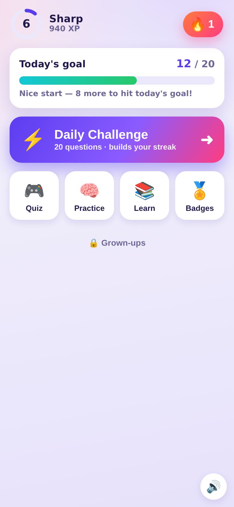
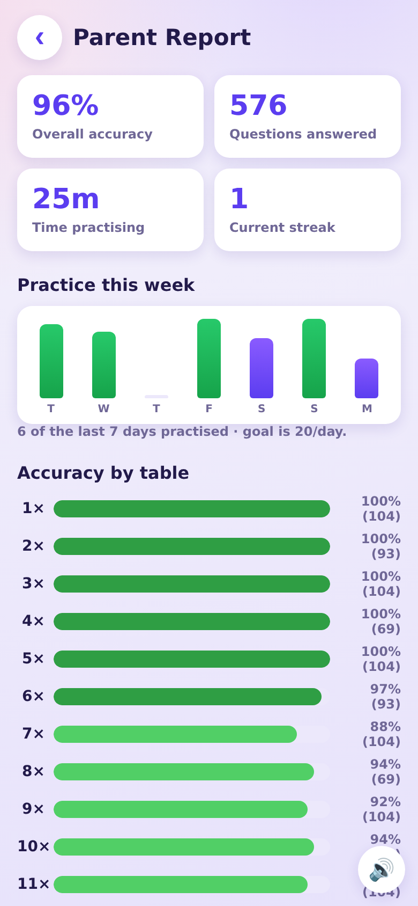

# 🦸 Times Table Hero

A fun, colorful web app that teaches kids the times tables up to **12**. It's built
as a **PWA** (Progressive Web App), so it installs onto an iPhone's home screen and
runs full-screen and offline — just like a real app — with **no App Store, no Mac,
and no Xcode required**.



## What's inside

Designed for around age 10 — real recall (typed answers), a proper game loop, and a
reason to come back every day.

**For the kid**
- **⚡️ Daily Challenge** — one tap starts a set of questions that *adapts to her weak
  spots* and counts toward her daily goal & streak.
- **🎮 Quiz** — pick tables, choose **Type** (number pad) or **Choose** (multiple
  choice) and 10 / 15 / 25 questions. Timed feel with a combo multiplier.
- **🧠 Practice** — relaxed flashcards, including a **🎯 "My tricky ones"** deck built
  from the exact facts she gets wrong most.
- **📚 Learn** — see any full table, 1–12.
- **Streaks, XP & levels** — every correct answer earns XP (with speed & combo
  bonuses); levels come with ranks (Rookie → Legend). A 🔥 streak grows each day she
  hits her goal.
- **🏅 Badges** — a dozen unlockables (First Win, Lightning, Table Master, Week
  Warrior, Century, …) to chase.
- Gentle sound effects & haptics (mute button included), encouraging messages, and
  confetti/level-up celebrations.

**For the parent — a private report** (see below).

Everything is saved on the device and works offline. No accounts, no ads, no data
leaves the phone.

## 👀 The Parent Report

Tap **🔒 Grown-ups** at the bottom of the home screen and solve a quick two-digit
multiplication (a light gate so she can't wander in and accidentally reset things).
Inside you'll find:



- **Overall accuracy, questions answered, and time practising.**
- **Practice this week** — a bar per day (green = daily goal met) so you can see if the
  habit is sticking.
- **Accuracy by table** — a color-coded bar for each table 1–12.
- **Trickiest facts** — the specific facts she gets wrong most (e.g. `7 × 8 — 67%`), so
  you know exactly what to help with.
- **Fact mastery map** — a 12×12 heatmap (green = strong, red = needs work, grey = not
  tried) for the whole picture at a glance.
- **Daily goal** setting (5–50 questions/day).
- **Daily Challenge tables** — choose exactly which tables her Daily Challenge draws
  from (e.g. tap **Hard 6–12** to focus on the tricky ones), and a reset button.

> The report reads the same on-device history the game records — nothing is uploaded.

## Put it on your iPhone (2 steps)

### 1. Turn on free hosting (GitHub Pages) — one time
1. On GitHub, open this repo → **Settings** → **Pages** (left sidebar).
2. Under **Build and deployment → Source**, choose **Deploy from a branch**.
3. Set **Branch** to `main` (or whichever branch has the code) and folder to **`/ (root)`**, then **Save**.
4. Wait ~1 minute. GitHub shows a live URL like
   `https://<your-username>.github.io/times-table-hero/`.

### 2. Add it to the home screen
1. Open that URL in **Safari** on the iPhone.
2. Tap the **Share** button (□↑) → **Add to Home Screen** → **Add**.
3. Done! Tap the new **Table Hero** icon. It opens full-screen and works even with no
   internet.

> Tip: the app remembers stars per-device. It works great offline once opened.

## Run it on your computer (optional)

Any static file server works — no build step. For example:

```bash
python3 -m http.server 8000
# then open http://localhost:8000
```

> Service workers (offline mode) need `http://localhost` or an HTTPS URL — opening the
> file directly with `file://` will show the app but skip offline caching. GitHub Pages
> is HTTPS, so it works fully there.

## Project layout

```
index.html              # all screens (markup)
css/styles.css          # styling (light + dark, iPhone safe-areas)
js/app.js               # all game logic, no dependencies
manifest.webmanifest    # PWA metadata (name, icons, colors)
service-worker.js       # offline caching
icons/                  # app icons (generated)
make_icons.py           # regenerates the icons (needs Pillow)
smoke.js                # headless browser test of the core flows
```

## Tweaking it

- **Change the top number** (e.g. up to 15): edit `var MAX = 12;` near the top of
  `js/app.js`.
- **Tune XP / levels / badges**: see the `xp / level`, `BADGES`, and `submit()` sections
  in `js/app.js`.
- **Default daily goal**: `dailyGoal` in `freshProgress()` (or change it live in the
  Parent Report).
- **Regenerate icons** after editing colors: `pip install Pillow && python3 make_icons.py`.
- If you change any file, bump `var CACHE = "tth-v1";` in `service-worker.js` so phones
  pick up the new version.

Made with 💜 for a future math whiz.
